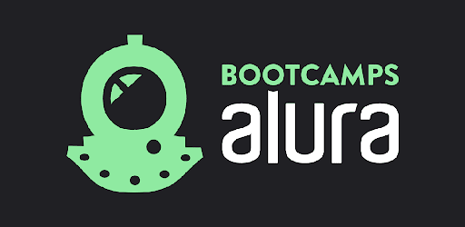

    
 

# Bootcamp Data Science Aplicada 2

Bem vindo!

Aqui você encontrará os arquivos e notebooks utilizados durante o Bootcamp Data Science Aplicada 2 da [Alura](http://www.alura.com.br/), uma plataforma de cursos de TI.

## O que é Bootcamp?

Um bootcamp é um treinamento intensivo que tem o objetivo de fazer com que seus estudantes absorvam o conhecimento teórico de maneira conjunta com a prática. 

Algumas instituições de ensino ainda utilizam os métodos tradicionais e muito demorados para formar um profissional que esteja apto a atuar no mercado.

No entanto, o bootcamp é uma nova metodologia de educação que vem se mostrando cada vez mais eficiente na formação e inserção de novos profissionais qualificados no mercado de trabalho.

Para saber mais [veja esse site](https://www.lewagon.com/pt-BR/blog/o-que-e-bootcamp)

- - - 

## Organização

Cada módulo foi divido em pastas que contém seus arquivos das aulas e fontes de dados e respostas dos desafios propostos.
Os projetos de cada módulo estão em pasta própria iniciando com **projeto...**.

- - - 

## Módulos

### Módulo 1: Python e pandas para análise de dados reais
### Módulo 2: Visualização de dados com Seaborn e Matplotlib
### Módulo 3: Análise de séries temporais
### Módulo 4: Tratamento, análise e Machine Learning aplicado
### Módulo 5: Modelos, métricas e validações em Machine Learning
### Módulo 6: Extra

- - - 

    
 

 - - - 

P.S.: ainda em construção
